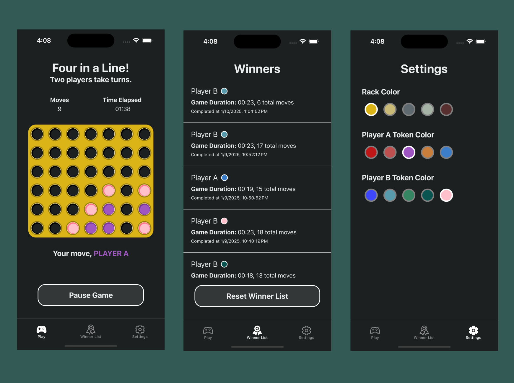

# Four in a Line

This app digitizes the classic four-in-a-row style game. It allows players to customize their experience with different UI colors, and records game winnings data. 



## About this project

This project uses React Native, Expo, Redux, and Redux Toolkit. 

App features include:
- Game play for two players on a single device, which allows users to "drop" their tokens into empty slots by tapping on the board
- Recording metrics for total moves and game duration
- Ability to pause and resume the game timer 
- Ability to customize board and token colors
- Automatic game winnings history, with duration and moves, saved and persisted between app relaunches
- Auto-reset for exceeding time limits

## Running the App

1. Install dependencies

   ```bash
   npm install
   ```

2. Start the app

   ```bash
    npx expo start
   ```

In the output, you'll find options to open the app in a

- [development build](https://docs.expo.dev/develop/development-builds/introduction/)
- [Android emulator](https://docs.expo.dev/workflow/android-studio-emulator/)
- [iOS simulator](https://docs.expo.dev/workflow/ios-simulator/)
- [Expo Go](https://expo.dev/go), a limited sandbox for trying out app development with Expo